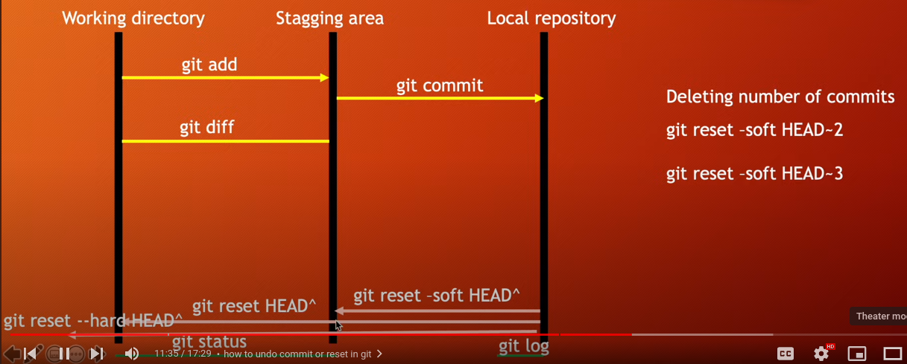

<!-- Markdown -->
We can use HTML tags in Markdown language.


1. Normal text & new line
My name is Fahim Khan.  
I'm a learner.  


2. Horizontal rule
---


3. Heading
# This is heading 1
## This is heading 2
### This is heading 3
#### This is heading 4
##### This is heading 5
###### This is heading 6


4. Paragraph
<p>This is Fahim. I'm 19 years old.
I'm a learner. Now I'm learning Markdown language.</p>


5. Italic  
_This is an Italic text_


6. Bold  
__This is Bold text.__


7. Strike-through  
~~This is Strike-through.~~


8. Inline code block  
`print("Hello World!")`


9 . Multiline code block  
``` python
def sum(x, y):
    return x + y


print(sum(10, 10))
```


10. List  
    1. Item1
    2. Item2
        1. Item1.1
        2. Item1.2
    3. Item3
    4. Item4


11. Unordered list
- Item1
    - Item1.1
- Item2
    1. item2.1
    2. item2.2
- Item3


12. Automatic link (My Social link)  
[My Github][github]  
[My X][twitter]  
[My YouTube][youtube]  
[Google][google]


13. Disable link  
`https://www.youtube.com`


<!-- All link is here -->
[youtube]: https://www.youtube.com/channel/UCStLXvKTQJFbW8WS6NBcuXg
[google]: https://google.com
[github]: https://github.com/fahimKhanOnly
[twitter]: https://twitter.com/FahimKhanOnly


14. Image



15. Emoji  
💀 👻


16. ### Table
| Name | Email |
| ---- | ----- |
| Fahim | fahim@email.com |
| Khan | khan@gmail.com |


17. Task list  
[x] Task 1  
[x] Task 2
[] Task 3
